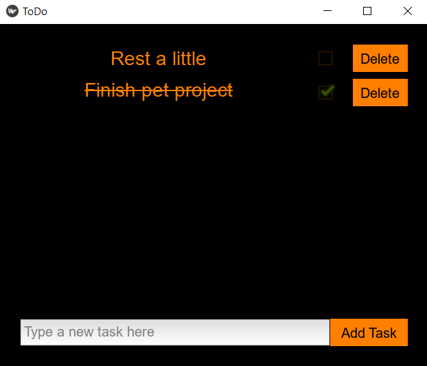

# To-Do App



To-Do app built using Python with Kivy for the GUI, SQLite for task storage, and an interactive console interface.

## Features

- Add new tasks
- Mark tasks as complete or pending
- Delete tasks
- Tasks are displayed in a grid layout
- Uses SQLite database to store tasks
- A console version is available for terminal usage
- Unit tests are included to ensure functionality

## Requirements

This project requires the following Python packages:

- Kivy==2.3.1
- Kivy-Garden==0.1.5
- kivy_deps.angle==0.4.0
- kivy_deps.glew==0.3.1
- kivy_deps.sdl2==0.8.0

You can install these dependencies by running:

```bash
pip install -r requirements.txt
```
## Project Structure

```
To-Do-App/
│
├── console_app.py          # Main logic for the console version
├── gui_app.py              # Main logic for the Kivy-based GUI version
├── core/
│   └── models.py           # TaskManager logic (CRUD operations)
├── database/
│   └── db.py              # Database connection and query execution
├── gui/
│   ├── kivy_gui.py        # Kivy GUI components and layout
│   └── factories/
│       └── widget_factory.py  # Factory for creating Kivy widgets
├── tests/
│   ├── test_console_app.py  # Unit tests for the console app
│   ├── test_gui_app.py      # Unit tests for the GUI app
│   └── test_task_manager.py # Unit tests for TaskManager CRUD operations
└── requirements.txt        # Project dependencies
```

## Running the App
### GUI Version
To run the Kivy GUI version of the app, simply execute:
```bash
python gui_app.py
```
### Console Version
To run the console version, execute:
```bash
python console_app.py
```
## Tests
Unit tests are included to ensure that the core functionality works as expected. They can be run using the unittest framework.

To run the tests:

1. Install the dependencies if you haven't already.

2. Run the tests using the following command:
```bash
python -m unittest discover
```
This will automatically discover and run all test files.
### Test Details
- test_console_app.py: Tests for the console app's task creation, input validation, and interaction with the TaskManager.

- test_gui_app.py: Tests for the Kivy GUI version, including task creation and refreshing the task list.

- test_task_manager.py: Tests for the core TaskManager class, covering CRUD operations on tasks in the database.

## License

This project is open-source and available under the MIT License. See the [LICENSE](LICENSE) file for details.

## Author

[Dain Atreides](https://github.com/DainAtreides)
